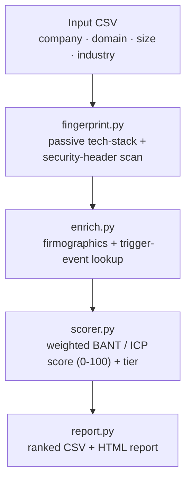

<div align="center">

# LeadRecon

### Tech-stack recon and ICP lead-scoring, built with security-engineering reconnaissance techniques


<br/>

*Passive reconnaissance techniques from security engineering — repointed at sales qualification.*

</div>

<br/>

---

<br/>

## The Problem

Sales and BD teams burn hours on manual lead research — company size, industry fit, what tools a prospect already runs, whether something recent (funding, a launch, a hire) makes them worth calling today. That workflow is repetitive enough to automate.

**LeadRecon does the research for you, in seconds instead of hours.**

<br/>

---

<br/>

## How It Works



<br/>

---

<br/>

## Why This Exists

> I'm a cybersecurity student moving into SaaS/tech sales. Instead of just completing a sales course, I wanted to prove I could build the actual tooling behind lead generation and qualification — using the same passive-recon and fingerprinting instincts from my security background, aimed at a sales problem instead of a pentest.

<br/>

---

<br/>

## Sample Output

Run live against 6 real public domains (`data/input_leads.csv`):

<div align="center">

| Company | Score | Tier | Why |
|:--|:-:|:-:|:--|
| **Notion** | `74` | **Hot** | Company size in target range |
| **Basecamp** | `74` | **Hot** | Company size in target range |
| **Wikipedia** | `60` | Warm | Size match, industry mismatch |
| **Stripe** | `54` | Warm | Company size outside target range |
| **Shopify** | `54` | Warm | Company size outside target range |
| **HubSpot** | `54` | Warm | Company size outside target range |

</div>

Full interactive report: `data/output_scored.html` · Raw data: `data/output_scored.csv`

<br/>

---

<br/>

## Setup

```bash
git clone https://github.com/cipher-saif/leadrecon.git
cd leadrecon
pip install -r requirements.txt
```

<details>
<summary><b>Optional — enable live trigger-event detection</b></summary>
<br/>

```bash
export NEWSAPI_KEY="your-free-key-from-newsapi.org"
```

Without this, the tool just skips that scoring factor gracefully — nothing breaks.
</details>

<br/>

---

<br/>

## Usage

```bash
python main.py --input data/input_leads.csv --output data/output_scored
```

**Input CSV format:**

```csv
company_name,domain,employee_count,industry
Acme Inc,acme.com,150,software
```

> `employee_count` and `industry` are optional — leave blank and the scorer falls back to a neutral score instead of penalizing the lead.

<br/>

---

<br/>

## Configuring Your Own ICP

All business logic lives in one file — `leadrecon/config.py`:

```python
ICP_WEIGHTS = {
    "company_size_match": 25,
    "industry_match": 20,
    "tech_stack_signal": 25,
    "trigger_event": 15,
    "site_health_signal": 15,
}
TARGET_EMPLOYEE_MIN = 20
TARGET_EMPLOYEE_MAX = 1000
TARGET_INDUSTRIES = ["software", "saas", "..."]
```

Tune these to whatever you're actually selling — the weights and target ranges are the tool's business logic.

<br/>

---

<br/>

## Testing

Unit tests mock all network calls, so the suite runs fully offline:

```bash
python tests/test_fingerprint.py
```

<br/>

---

<br/>

## Roadmap

- [ ] Swap free-tier firmographic fallback for a real API (Clearbit, Crunchbase Pro)
- [ ] HubSpot/Zoho CRM integration — push Hot leads straight into a pipeline
- [ ] Slack webhook alert when a lead crosses the Hot threshold
- [ ] Async requests (`aiohttp`) for scanning larger lead lists faster

<br/>

---

<br/>

## Tech Stack

<div align="center">


</div>

<br/>

---

<br/>

## Ethical Note

This tool only ever makes a single, ordinary GET request to a site's public homepage — the same request any browser makes when you visit the page. No scanning, no authentication bypass, no non-public data. Built for legitimate sales research on companies you intend to contact, not surveillance.

<br/>

<div align="center">

*Built by <a href="https://github.com/cipher-saif">Mohammed Saifuddin</a> — bridging security engineering and sales.*

</div>
